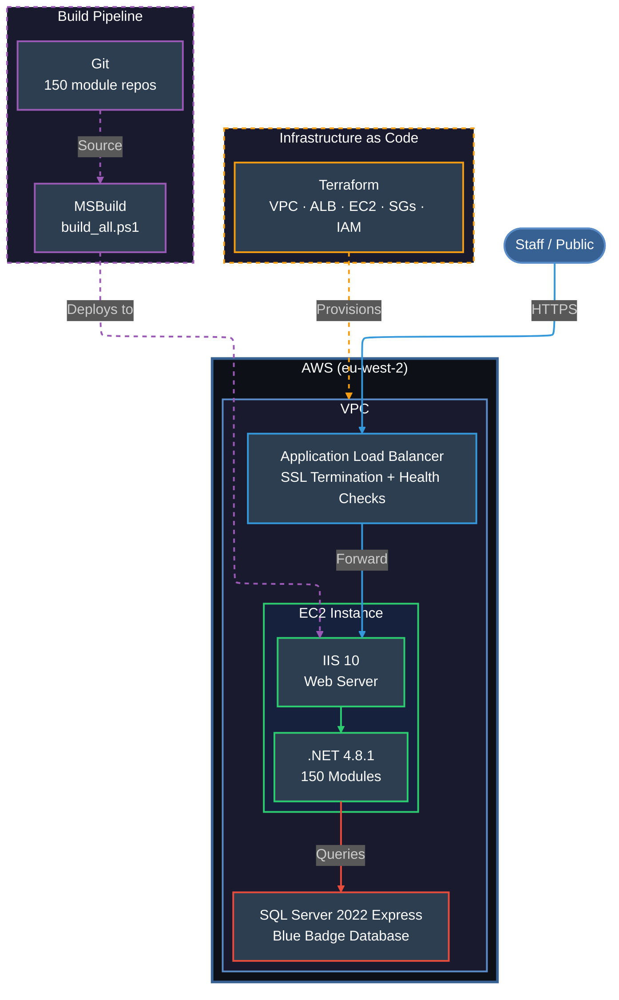

# BadgeAble — OutSystems Platform Detachment

Self-managed Blue Badge application detached from OutSystems 11 and running as standalone .NET applications on AWS, eliminating all platform licensing dependencies.

**For the complete case study with detailed technical analysis, see [CASE_STUDY.md](CASE_STUDY.md)**

**⚠️ Note: This is a sanitized version for portfolio purposes. All sensitive data, URLs, and identifiers have been anonymized.**

## Overview

A full Blue Badge case management application (150 modules) was detached from the OutSystems low-code platform and migrated to self-managed infrastructure on AWS. The system now runs independently with zero licensing costs or vendor dependencies.

## Architecture



## What Was Detached

- **150 .NET modules** extracted from OutSystems runtime
- **UI application** (Blue Badge customer-facing forms)
- **Case management** (staff workflows, approvals, appeals)
- **Communications** (letters, notifications)
- **Integrations** (external service lookups)

## Technology Stack

| Component | Technology |
|-----------|-----------|
| Runtime | .NET 4.8.1 |
| Web Server | IIS 10 |
| Database | SQL Server 2022 Express |
| Infrastructure | Terraform (VPC, ALB, EC2, SGs, IAM) |
| Build Tools | Visual Studio 2022 Build Tools (MSBuild) |
| Region | eu-west-2 (London) |

## Key Outcomes

- **Zero licensing dependencies** — no OutSystems licence required
- **Full source control** — all 150 modules in Git
- **Automated builds** — PowerShell batch build script
- **Infrastructure as Code** — Terraform for reproducibility
- **Comprehensive documentation** — Operations runbook + detachment summary

## Project Structure

```
├── src/                        # Detached .NET source code (150 modules)
│   ├── BlueBadge_UI/           # Main UI application
│   ├── BlueBadgeCase_CW/       # Case management
│   ├── BlueBadgeComms_CS/      # Communications
│   └── ...                     # 147 more modules
├── scripts/
│   └── build_all.ps1           # Builds all modules
├── infrastructure/
│   └── terraform/              # VPC, ALB, EC2, security groups, IAM
├── docs/
│   ├── OPERATIONS.md           # Full operations runbook
│   └── DETACHMENT_SUMMARY.md   # Manager-friendly summary
├── CASE_STUDY.md
└── README.md
```

## Building

```powershell
$msbuild = "C:\Program Files (x86)\Microsoft Visual Studio\2022\BuildTools\MSBuild\Current\Bin\MSBuild.exe"
& $msbuild src\<ModuleName>\<ModuleName>.sln /p:Configuration=Release /restore /v:minimal
```
